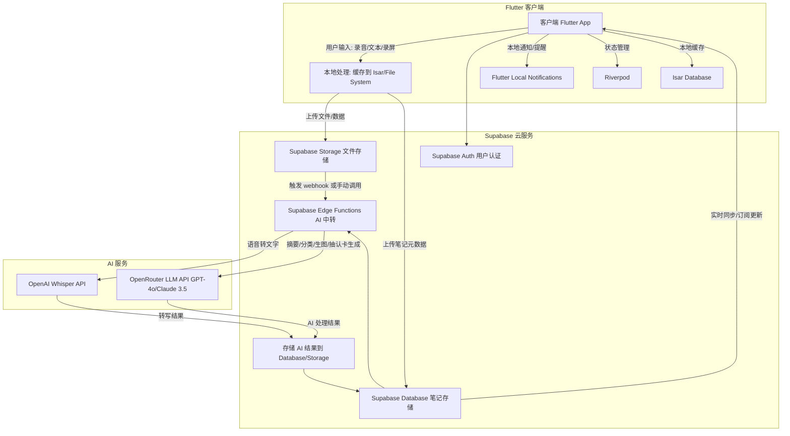
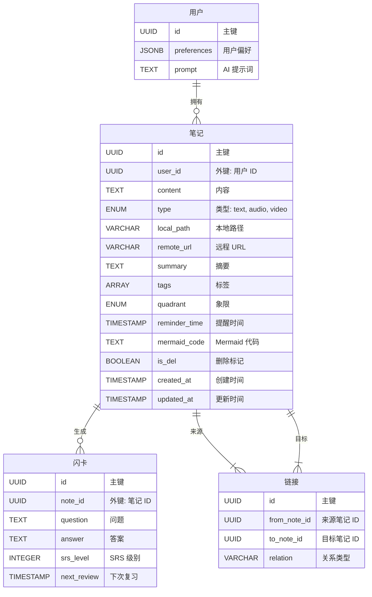
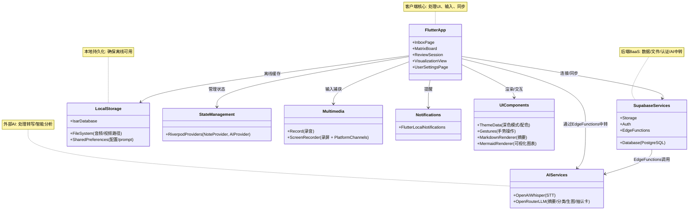
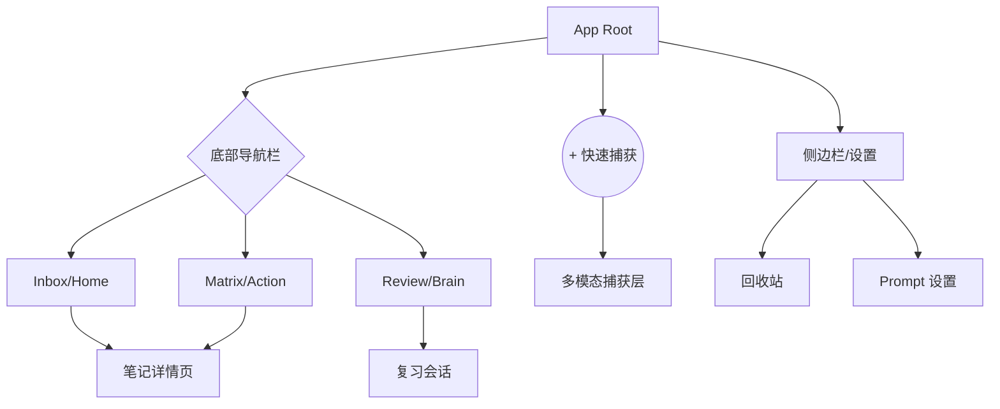

这份文档是为您量身定制的项目开发白皮书。它整合了您的原始需求、我的补充建议以及技术可行性评估。您可以将此文档保存为 `README.md` 或 `DESIGN.md`，作为后续开发的**唯一真理来源 (Source of Truth)**。

------

# AI 驱动的个人第二大脑 (AI Second Brain) - 开发设计文档

文档版本: v1.0

核心目标: 构建一个跨平台应用，实现信息的无缝捕获、AI 辅助整理、短期行动提醒与长期知识内化。

------

## 1. 功能需求清单

### 1.1 收集与捕获

- [ ] **多模态录入**: 支持一键录音、手动文本输入。
- [ ] **未来扩展**: 支持屏幕录制 (Android/Windows)。
- [ ] **快捷入口**: Android 桌面 Widget、通知栏快捷磁贴。
- [ ] **全局分享**: 支持从其他 App "分享" 文字/链接至本 App。
- [ ] **收件箱 (Inbox)**: 所有未处理内容默认进入 Inbox 状态，等待整理。

### 1.2 AI 整理与处理

- [ ] **自动转写**: 录音结束后，自动上传至 Whisper API 转为文字。
- [ ] **智能分类**: 接入 OpenRouter，AI 自动分析内容并打标：
  - `Tag: Short-term` (短期临时)
  - `Tag: Long-term` (长期学习)
- [ ] **人工核查**: 提供界面允许用户修正 AI 的转写内容和分类标签。
- [ ] **摘要生成**: 针对长内容，AI 自动生成 TL;DR (一句话总结)。

### 1.3 短期行动系统

- [ ] **艾森豪威尔矩阵**: AI 自动评估重要/紧急程度，将任务分配至四象限。
- [ ] **智能提醒**:
  - AI 根据紧急程度建议提醒时间。
  - 集成系统通知栏 (Notification Channel)。
- [ ] **矩阵着色逻辑**：
  - 重要且紧急 (🔴)：AI 判定为“必须立刻处理且影响重大”的短期任务。
  - 紧急不重要 (🟡)：AI 判定为“有明确截止时间但属于琐事”的短期内容（如：取快递、回复非重要消息）。
  - 重要不紧急 (🔵)：所有进入“长期学习”分类的内容默认落入此区域，使用蓝色。
  - 不重要不紧急 (🔘)：用户手动标记或 AI 判定为“仅作记录，无行动必要”的内容。
  - 已完成: 森林绿 (🟢 )
- [ ] **短期内容标识**：在卡片右上角使用一个半透明背景的标签 (Tag)。
- [ ] **倒计时强调**：对于 AI 设置了提醒时间的短期内容，颜色会随着时间临近逐渐从灰色向对应象限的基色（红/黄）“激活”变亮。
- [ ] **通知交互**: 通知栏直接操作（完成 / 推迟 / 标记不重要）。
- [ ] **看板视图**: 类似 Trello 的看板，展示待办事项。

### 1.4 长期记忆系统

- [ ] **间隔重复 (SRS)**: 实现类 Anki 算法 (SM-2)，根据反馈动态安排复习时间。
- [ ] **抽认卡生成**: AI 自动从笔记中提取 Q&A (问答对) 生成卡片。
- [ ] **知识可视化**:
  - AI 生成 Mermaid.js 代码。
  - App 内渲染：思维导图、流程图、鱼骨图、系统发育树。
- [ ] **知识链接**: AI 分析新内容与现有知识库中旧内容的关联，建立双向链接。
- [ ] **复习会话**: 专注的复习界面，无干扰模式。

------

## 2. 系统设计与架构

### 2.1 系统架构



**关键流程**：

- **输入捕获**：客户端本地录入，缓存到文件系统/Isar。
- **上传与中转**：上传至 Supabase，Edge Functions 处理 AI 调用（e.g., 转写、分类、生图），结果存储回 Database。
- **同步**：使用 Supabase Realtime 订阅，客户端实时拉取更新。
- **离线支持**：Isar + 文件系统确保离线可用，网络恢复时同步。

### 2.2 技术栈

基于“Android 优先，未来跨平台（Web/Desktop）”以及“多端数据同步”的需求，确定以下技术栈：

- **前端**：Flutter (Dart)，Riverpod 状态管理，Isar 本地数据库，path_provider 文件路径，shared_preferences 配置。
- **后端**：Supabase (PostgreSQL Database, Storage, Auth, Edge Functions)。
- **AI**：OpenRouter (LLM 聚合)，OpenAI Whisper (STT)。
- **多媒体**：record (录音)，screen_recorder + Platform Channels (录屏，Windows 适配)。
- **通知**：flutter_local_notifications。
- **可视化**：flutter_markdown + mermaid.js 渲染包 (e.g., flutter_mermaid)。

- **其他**：supabase客户端库supabase-flutter。

### 2.3 数据模型设计

使用 Supabase PostgreSQL 表定义数据 schema。所有表启用 Row Level Security (RLS) 以用户 ID 隔离数据。

#### 2.3.1 实体关系图



#### 2.3.2 核心表结构

| 表名           | 字段名称      | 类型                                                         | 描述                                               | 约束/索引              |
| -------------- | ------------- | ------------------------------------------------------------ | -------------------------------------------------- | ---------------------- |
| **users**      | id            | UUID                                                         | 用户 ID (Supabase Auth 自动生成)                   | 主键                   |
|                | preferences   | JSONB                                                        | 用户偏好 (e.g., {"dark_mode": true})               | -                      |
|                | prompt        | TEXT                                                         | 用户自定义 AI 提示词 (e.g., 用于注入到 LLM Prompt) | -                      |
| **notes**      | id            | UUID                                                         | 笔记 ID                                            | 主键                   |
|                | user_id       | UUID                                                         | 外键引用 users.id                                  | 外键, 索引             |
|                | content       | TEXT                                                         | 原始文本或转写文本                                 | -                      |
|                | type          | ENUM('text', 'audio', 'video')                               | 输入类型                                           | -                      |
|                | local_path    | VARCHAR(255)                                                 | 本地文件路径 (e.g., /app/docs/rec_001.m4a)         | -                      |
|                | remote_url    | VARCHAR(255)                                                 | Supabase Storage URL                               | -                      |
|                | summary       | TEXT                                                         | AI 生成摘要 (TL;DR)                                | -                      |
|                | tags          | ARRAY[VARCHAR]                                               | 标签 (e.g., ['short-term', 'long-term'])           | GIN 索引 (数组搜索)    |
|                | quadrant      | ENUM('q1_urgent_important', 'q2_important_not_urgent', 'q3_urgent_not_important', 'q4_not_important_not_urgent', 'completed') | 艾森豪威尔象限                                     | -                      |
|                | reminder_time | TIMESTAMP                                                    | 提醒时间                                           | 索引 (定时任务)        |
|                | mermaid_code  | TEXT                                                         | AI 生成的 Mermaid.js 代码 (用于可视化渲染)         | -                      |
|                | is_del        | BOOLEAN                                                      | 软删除标记 (true 表示已删除)                       | 默认 false, 索引       |
|                | created_at    | TIMESTAMP                                                    | 创建时间                                           | 默认 now(), 索引       |
|                | updated_at    | TIMESTAMP                                                    | 更新时间                                           | 默认 now(), 触发器更新 |
| **flashcards** | id            | UUID                                                         | 卡片 ID                                            | 主键                   |
|                | note_id       | UUID                                                         | 外键引用 notes.id                                  | 外键, 索引             |
|                | question      | TEXT                                                         | 问题                                               | -                      |
|                | answer        | TEXT                                                         | 答案                                               | -                      |
|                | srs_level     | INTEGER                                                      | SRS 级别 (SM-2 算法，初始 0)                       | -                      |
|                | next_review   | TIMESTAMP                                                    | 下次复习时间                                       | 索引 (复习调度)        |
| **links**      | id            | UUID                                                         | 链接 ID                                            | 主键                   |
|                | from_note_id  | UUID                                                         | 来源笔记 ID                                        | 外键, 复合索引         |
|                | to_note_id    | UUID                                                         | 目标笔记 ID                                        | 外键, 复合索引         |
|                | relation      | VARCHAR(50)                                                  | 关系类型 (e.g., 'related', 'prerequisite')         | -                      |

- **扩展**：使用 JSONB 字段存储额外元数据 (e.g., notes 中的 mermaid_code 为可视化代码)。
- **SRS 算法**：在 flashcards 表中实现 SM-2：基于用户反馈 (easy/hard) 更新 srs_level 和 next_review (公式：interval = previous_interval * easiness_factor)。
- **Inbox 状态**：notes 表中添加 status ENUM('inbox', 'processed', 'archived')，默认 'inbox'。

#### 2.3.3 数据同步策略

- **本地-云端**：Flutter 使用 supabase_flutter 客户端，上传时先存本地 Isar (镜像 schema)，成功后更新 remote_url。
- **实时更新**：Supabase Realtime 订阅 notes/flashcards 表变化，客户端 Riverpod 监听并刷新 UI。
- **冲突解决**：使用 updated_at 字段，客户端优先云端版本。

### 2.5 组件设计

#### 2.5.1 组件设计图



#### 2.5.2 前端组件

- **页面结构**：
  - Inbox Page：列表视图 (ListView.builder)，显示未处理 notes (status = 'inbox' AND is_del = false)，手势：左滑归档，右滑处理。
  - Matrix Board：GridView 或 CustomScrollView 实现四象限看板，颜色渐变动画 (AnimationController)，仅显示 is_del = false 的短期 notes。
  - Review Session：PageView 翻页卡片，按钮反馈 (easy/hard) 更新 SRS，仅针对 is_del = false 的长期 notes。
  - **Visualization View**：MarkdownBody 渲染摘要 + Mermaid 渲染组件显示图表，支持缩放 (InteractiveViewer)。
  - **Recycle Bin Page**：专用页面，显示 is_del = true 的 notes，使用 ListView.builder 过滤查询。支持恢复操作（长按或按钮 SET is_del = false，并同步至 Supabase）；永久删除（物理 DELETE FROM notes）；清空回收站（批量 SET is_del = false 或 DELETE）。页面集成搜索栏 (TextField) 过滤笔记，UI 风格与 Inbox 一致，但使用板岩灰表示删除状态。导航：从主菜单或侧边栏进入。
  - **User Settings Page**：Prompt 编辑器 (TextField)，保存到 users.prompt，同步至 Supabase。

- **输入捕获**：
  - **手动输入界面**：使用 TextField 或 TextFormField 支持多行文本输入。集成 Markdown 支持 (e.g., flutter_markdown) 实时预览。输入后，创建 notes 对象 (type = 'text', content = 输入文本)，本地保存到 Isar，上传至 Supabase Database（无文件存储）。支持附加标签/象限手动选择。快捷入口：浮动按钮 (FloatingActionButton) 或通知栏快捷方式触发输入对话框 (showDialog with TextField)。
  - **录音/录屏**：与手动输入并列在捕获界面 (e.g., TabBar: 'Text' / 'Audio' / 'Video')。
- **状态管理**：
  - **NoteProvider**：管理 notes 列表，添加 recycleBinNotes 流 (StreamProvider) 查询 is_del = true；结合 Isar 查询和 Supabase 订阅，过滤 is_del。
  - **AIProvider**：触发 Edge Function 调用时从 users.prompt 注入自定义提示 (e.g., Prompt = user_prompt + base_prompt)，轮询结果；手动输入后可选立即调用 processNote（如果用户选择 AI 整理）。
- **UI 主题**：ThemeData 定义深色模式，ColorScheme 使用文档指定颜色 (e.g., Colors.red[300] for q1)。Recycle Bin Page 使用次要颜色 (板岩灰) 覆盖。

#### 2.5.3 后端组件 (Supabase Edge Functions)

- **删除函数**：删除时使用 softDeleteNote 函数，SET is_del = true。
- **AI 中转函数**：使用 Deno/JavaScript 编写 Edge Functions，避免客户端直接调用 AI。
  - **transcribeAudio**：参数 (file_url)，调用 Whisper API，转写后更新 notes.content。
  - **processNote**：更新时从 users 表读取 prompt，注入到 OpenRouter Prompt 中 (e.g., full_prompt = user.prompt + " Analyze this: [content]")。参数 (note_id)，调用 OpenRouter：
    - Prompt：分析 content，生成 summary、tags、quadrant、flashcards (if long-term)。
    - 存储：插入 flashcards，更新 notes。
  - **generateVisualization**：参数 (note_id)，Prompt 生成 Mermaid 代码，存入 notes.mermaid_code。
- **Webhook**：Storage 上传后触发 processNote 函数。
- **安全**：Functions 只允许认证用户调用，RLS 限制数据访问。

#### 2.5.4 AI 集成细节

- **Prompt 工程**：
  - 分类： "Follow this style: [user.prompt]. Analyze this text: [content]. Classify as 'short-term' or 'long-term'. Output JSON: {tag: '...', quadrant: '...'}"
  - 摘要： "Follow this style: [user.prompt]. Summarize in one sentence: [content]"
  - 抽认卡： "Follow this style: [user.prompt]. Extract 3-5 Q&A pairs from: [content]. Output array of {question: '...', answer: '...'}"
  - 可视化： "Follow this style: [user.prompt]. Generate Mermaid mindmap code for: [content]"
- **可视化**：若需求扩展，使用 OpenRouter 集成 DALL-E（文生图） 等，生成 Mermaid 代码存入 notes.mermaid_code；客户端渲染时检查字段是否存在。
- **成本优化**：Edge Functions 中添加 VAD (e.g., 使用 Web Audio API 检测静音，裁剪音频)。

---

## 3. UI/UX 设计

### 3.1 设计规范

> 可以将此部分直接用于 Flutter 的 `ThemeData` 配置中。

**设计理念**: “现代极简”与“Bento Grid”风格，并优先适配深色模式。**交互**: 强调手势操作（左滑归档，右滑完成，长按编辑）。

#### 3.1.1 配色方案

使用 **HSB** 模式微调色彩，确保在深色模式下既有足够的对比度，又不会刺眼（避免纯黑 `#000000` 和纯白 `#FFFFFF`）。

##### 3.1.1.1 中性色 \- 深色模式基石

用于背景、卡片容器和文本。

| **色名**       | **HEX 值** | **用途**                     | **Flutter 对应**          |
| -------------- | ---------- | ---------------------------- | ------------------------- |
| Background     | `#121212`  | 全局页面背景 (OLED 省电黑)   | `scaffoldBackgroundColor` |
| Surface 1      | `#1E1E1E`  | 标准卡片背景 (Bento 单元格)  | `cardColor`               |
| Surface 2      | `#2C2C2C`  | 悬停状态 / 模态弹窗 / 侧边栏 | `dialogBackgroundColor`   |
| Border         | `#383838`  | 分割线、边框                 | `dividerColor`            |
| Text Primary   | `#E0E0E0`  | 主要标题 (87% 白)            | `textTheme.bodyLarge`     |
| Text Secondary | `#A0A0A0`  | 次要文本、正文 (60% 白)      | `textTheme.bodyMedium`    |
| Text Disabled  | `#656565`  | 禁用状态、提示文本           | `disabledColor`           |

##### 3.1.1.2 语义功能色

严格遵循文档定义的“艾森豪威尔矩阵”逻辑和状态标识。

| **语义场景**        | **颜色名称**  | **HEX 值** | **视觉心理**             |
| ------------------- | ------------- | ---------- | ------------------------ |
| Q1 (紧急重要)       | Soft Red      | `#FF6B6B`  | 警示、高优先级、截止日期 |
| Q2 (重要不紧急)     | Prussian Blue | `#4D96FF`  | 专注、长期知识、品牌主色 |
| Q3 (紧急不重要**)** | Mustard       | `#F6C90E`  | 提醒、琐事、干扰         |
| Q4 (不重要不紧急)   | Slate Grey    | `#6C757D`  | 消隐、归档、回收站       |
| Success (完成)      | Forest Green  | `#6BCB77`  | 完成勾选、正向反馈       |
| Error (错误)        | Error Red     | `#CF6679`  | 系统错误、删除确认       |

#### 3.1.2 字体排印

为了保证跨平台的一致性和易读性，使用 Google Fonts。

- 主字体 (UI): **Inter**。现代、高可读性，非常适合数字界面。

- 阅读字体 (长文/沉浸模式): **Merriweather**。衬线体，适合“长期学习”模块的阅读体验。

- 代码/数据: **JetBrains Mono**。用于 Mermaid 代码渲染和 Markdown 代码块。

**字号阶梯：**

| **样式名称**    | **字号 (sp)** | **字重 (Weight)** | **行高 (Height)** | **用途**               |
| --------------- | ------------- | ----------------- | ----------------- | ---------------------- |
| Display Large   | 32            | Bold (700)        | 1.2               | 首页问候、核心数据大屏 |
| Headline Medium | 24            | SemiBold (600)    | 1.3               | 页面标题               |
| Title Medium    | 18            | Medium (500)      | 1.4               | 卡片标题、Bento 模块头 |
| Body Large      | 16            | Regular (400)     | 1.5               | 笔记正文 (阅读舒适区)  |
| Body Medium     | 14            | Regular (400)     | 1.5               | 列表摘要、设置项       |
| Caption/Label   | 12            | Medium (500)      | 1.2               | 标签 (Tags)、时间戳    |

#### 3.1.3 组件设计规则

这是确保“Bento Grid”风格统一的关键。

##### 3.1.3.1 容器与圆角

所有内容块都必须封装在卡片中。

- 圆角: `16px` (统一标准)。
- 内边距: `16px` (内容与卡片边缘的距离)。
- 阴影: 深色模式下不推荐使用重阴影，改用**边框高亮**或**颜色层级**。
  - 常态: 无边框，背景色 `#1E1E1E`。
  - 激活/选中: 边框 `1.5px`，颜色为对应象限色 (如 Q1 为红色边框)。

##### 3.1.3.2 按钮

- 主要按钮

  - 样式: 实心填充。

  - 颜色: 品牌蓝 (`#4D96FF`) 或当前上下文的功能色。

  - 圆角: `30px` (Pill shape/胶囊形)。

  - 高度: `48px` (易于手指点击)。

- 次要按钮

  - 样式: 描边 或 半透明背景。

  - 边框/文字: `#E0E0E0`。

- 录音按钮

  - 样式: 仅在捕获层出现。圆形，直径 `72px`。

  - 颜色: 渐变红或纯红，带呼吸阴影。

##### 3.1.3.3 标签

用于展示 AI 生成的分类 (`Short-term`, `Long-term`)。

- 形状: 小圆角矩形 (`Radius: 8px`)。
- 样式: 彩色半透明背景 + 彩色文字。
  - *Short-term*: 背景 `#F6C90E` (15% opacity)，文字 `#F6C90E`。
  - *Long-term*: 背景 `#4D96FF` (15% opacity)，文字 `#4D96FF`。

##### 3.1.3.4 图标

- 图标库: Material Symbols Rounded。
- 尺寸:
  - 导航栏: `24px`
  - 列表操作: `20px`
  - 小提示: `16px`

#### 3.1.4 间距与布局

使用 **8点网格系统**。所有的间距、尺寸都应该是 8 的倍数。

- xs (4px): 元素内部极小间距（如文字与副标题）。
- s (8px): 相关元素间距（如图标与文字）。
- m (16px): 标准间距（卡片内边距，组件间距）。
- l (24px): 模块间距（不同 Bento 块之间）。
- xl (32px): 页面边缘间距（Section header 上方）。

#### 3.1.5 Flutter `ThemeData` 配置示例

```dart
// theme.dart
import 'package:flutter/material.dart';

class AppTheme {
  // 定义核心颜色
  static const Color _background = Color(0xFF121212);
  static const Color _surface = Color(0xFF1E1E1E);
  static const Color _primaryBrand = Color(0xFF4D96FF); // Q2 & Brand
  static const Color _q1Red = Color(0xFFFF6B6B);
  static const Color _q3Yellow = Color(0xFFF6C90E);
  static const Color _textPrimary = Color(0xFFE0E0E0);
  static const Color _textSecondary = Color(0xFFA0A0A0);

  static final ThemeData darkTheme = ThemeData(
    useMaterial3: true,
    brightness: Brightness.dark,
    scaffoldBackgroundColor: _background,
    primaryColor: _primaryBrand,
    
    // 字体配置
    fontFamily: 'Inter', 
    textTheme: const TextTheme(
      headlineMedium: TextStyle(fontSize: 24, fontWeight: FontWeight.w600, color: _textPrimary),
      titleMedium: TextStyle(fontSize: 18, fontWeight: FontWeight.w500, color: _textPrimary),
      bodyLarge: TextStyle(fontSize: 16, height: 1.5, color: _textPrimary),
      bodyMedium: TextStyle(fontSize: 14, color: _textSecondary),
    ),

    // 卡片通用样式
    cardTheme: CardTheme(
      color: _surface,
      elevation: 0, // 扁平化
      margin: const EdgeInsets.only(bottom: 12),
      shape: RoundedRectangleBorder(
        borderRadius: BorderRadius.circular(16), // Bento 风格圆角
        side: BorderSide.none,
      ),
    ),

    // 按钮样式
    elevatedButtonTheme: ElevatedButtonThemeData(
      style: ElevatedButton.styleFrom(
        backgroundColor: _primaryBrand,
        foregroundColor: Colors.white,
        elevation: 2,
        shape: const StadiumBorder(), // 胶囊形
        padding: const EdgeInsets.symmetric(horizontal: 24, vertical: 12),
      ),
    ),
    
    // 底部导航栏
    bottomNavigationBarTheme: const BottomNavigationBarThemeData(
      backgroundColor: _background,
      selectedItemColor: _primaryBrand,
      unselectedItemColor: _textSecondary,
      type: BottomNavigationBarType.fixed,
    ),
    
    // 颜色方案 (用于组件自动取色)
    colorScheme: const ColorScheme.dark(
      primary: _primaryBrand,
      secondary: _q3Yellow,
      surface: _surface,
      background: _background,
      error: _q1Red,
      onPrimary: Colors.white,
      onSurface: _textPrimary,
    ),
  );
}
```

### 3.2 站点地图

为了实现“快速捕获”和“分类查看”，采用 **"Bottom Navigation + Floating Action Button (FAB)"** 的布局结构。



### 3.3 核心界面 UX 详设

#### 3.3.1 首页：收件箱 (Inbox) 

此页面的目标是**快速浏览与处理**。

- **布局**: 列表视图。
- **卡片设计**: 极简 Bento 风格，左侧显示内容摘要，右侧显示 AI 生成的标签 (Short-term/Long-term)。使用 `flutter_staggered_grid_view` 来实现瀑布流和大小不一的网格布局。
- **手势交互 (Gestures)**:
  - **👈 左滑**: 归档/放入回收站（显示灰色图标）。背景色渐变为深灰。
  - **👉 右滑**: 触发“人工核查”或标记为“已处理”。背景色渐变为蓝色。
- **微交互**: 当列表为空时，显示一个“Zen”状态的插画（如平静的湖面），鼓励用户保持 Inbox Zero。

#### 3.3.2 捕获层 - "无摩擦录入"

不跳转新页面，而是弹出一个占据屏幕 60% 高度的 **Bottom Modal Sheet**，保持上下文。

- **多模态 Tab**: 顶部切换 `文本` | `录音` | `视频(未来)`。
- **录音体验**:
  - 中心为一个巨大的红色录音按钮，带有呼吸灯效。
  - **实时反馈**: 录音时显示声波纹 (Visualizer)，让用户确信设备正在工作。使用 `audio_waveforms` 包来实现高性能的实时波形绘制。
  - **AI 预处理**: 录音结束时，显示“AI 正在转写...”的微动画（例如光流在卡片上划过），而不是枯燥的加载圈。
- **文本输入**: 自动弹出键盘，输入框支持 Markdown 快捷键栏（加粗、列表、链接）。

#### 3.3.3 行动看板：艾森豪威尔矩阵

在移动端（竖屏）强行塞入 2x2 的网格会导致内容显示不全。

- **UX 解决方案**: **顶部导航锚点 + 侧滑页面视图**
  - **默认视图**: 垂直滚动的“泳道图” (Swimlanes) 或 Tab 切换。
  - **Tab 设计**: 顶部四个 Tab 对应四个象限颜色 (🔴 Q1 | 🔵 Q2 | 🟡 Q3 | 🔘 Q4)。
  - **倒计时强调**: 卡片边缘会有进度条效果 (Progress Border)，随着 Deadline 临近，进度条颜色变红并变亮（Glow Effect）。

#### 3.3.4 知识内化：回顾 (Review Session)

- **沉浸模式**: 进入此页面自动隐藏底部导航栏。
- **卡片设计**:
  - 正面：问题。
  - 点击卡片：卡片 3D 翻转，显示背面答案。
- **反馈控制**: 屏幕底部显示四个大按钮（根据 SM-2 算法）：
  - `忘记` - 红色
  - `困难` - 橙色
  - `一般` - 蓝色
  - `简单 - 绿色
- **可视化渲染**: 如果卡片包含 Mermaid 图表，支持双指缩放查看细节。

### 3.4 线框图

#### 3.4.1 捕获流程

为了展示 **捕获流程模块**，将其拆分为四个关键状态的低保真线框图。

- **触发态**：唤起捕获。

- **录制态**：正在输入。

- **处理态**：AI 异步工作。

- **结果态**：呈现与核查。

流程图例：`[ ]` = 按钮/图标 | `===` = 文本行 | `~~~` = 波形/图像

##### 3.4.1.1 触发态：主页 FAB

用户在 Inbox 页面，准备记录。

```Plaintext
+-----------------------------+
|  Inbox (3)              (⚙) |  <- 顶部栏
+-----------------------------+
| [Tag: Urgent]               |
| [ ] 买牛奶                  |  <- 列表项
|     14:00 提醒              |
+-----------------------------+
| [Tag: Learning]             |
| [ ] Flutter Riverpod 笔记   |
|     ...                     |
+-----------------------------+
|                             |
|                             |
|            ( + )            |  <- 底部中心悬浮按钮 (FAB)
|                             |  <- 交互：点击立刻弹出
+-----------------------------+
| [Home]  [Matrix]  [Review]  |  <- 底部导航栏
+-----------------------------+
```

**UX 细节**：

- **位置**：底部居中，符合拇指操作热区。
- **长按交互**：未来考虑增加“长按 FAB”直接开始录音的快捷操作，跳过点击步骤。

##### 3.4.1.2 录制态：模态浮层

点击 FAB 后，底部弹出的半屏浮层。不跳转页面，保持背景可见（背景变暗）。

```Plaintext
+-----------------------------+
| (背景半透明遮罩，可见Inbox) |
|                             |
+-----------------------------+
|      ________v________      |  <- 下拉手柄 (拖拽关闭)
|                             |
|  文本   |  *录音* |  视频  |  <- 顶部 Tab 切换
| --------------------------- |
|                             |
|       00:12 / 10:00         |  <- 计时器
|                             |
|   |||||||||||||||||||||||   |  <- 实时声波 (Visualizer)
|   || ||||| ||||| ||||| ||   |  <- 随音量跳动
|                             |
|                             |
|          (  ⬛  )           |  <- 巨大的停止按钮 (呼吸动效)
|                             |
|                             |
|      [取消]      [完成]     |  <- 辅助操作
+-----------------------------+
```

**UX 细节**：

- **默认状态**：根据用户上次习惯或默认设置（默认为录音）。
- **触觉反馈**：按下“开始”时手机短震动，模拟物理录音笔手感。
- **容错**：提供“取消”按钮，防止误触。

##### 3.4.1.3 处理态：列表骨架屏

录音结束，浮层关闭。为了不让用户盯着“转圈圈”发呆，立刻在 Inbox 列表顶部插入一个“临时卡片”。

```Plaintext
+-----------------------------+
|  Inbox (Processing...)  (⚙) |
+-----------------------------+
| +-------------------------+ |
| | (✨ AI 处理中...)       | |  <- 临时占位卡片
| | [=====================] | |  <- 进度条 (上传 -> 转写 -> 分析)
| | 2026-01-22 14:30.m4a    | |
| +-------------------------+ |
+-----------------------------+
| [Tag: Urgent]               |
| [ ] 买牛奶                  |
+-----------------------------+
```

**UX 细节**：

- **异步体验**：用户不需要等待，可以继续浏览其他笔记。
- **状态指示**：使用微动画（Sparkles ✨）暗示 AI 正在“思考”（生成摘要/分类），而不仅仅是“加载”。

##### 3.4.1.4 结果态：智能卡片呈现

AI 处理完成 (Supabase Edge Function 返回数据)，骨架屏通过淡入动画\变为正式卡片。

```Plaintext
+-----------------------------+
| +-------------------------+ |
| | #Short-term 🟡  [Edit]  | |  <- AI 自动打的标 (Tag)
| |                         | |
| | **取快递并寄送合同** | |  <- AI 生成的标题/摘要
| |                         | |
| | > 记得带身份证，合同在  | |  <- 内容预览 (截取)
| | 书包里...               | |
| |                         | |
| | [> Play] --o------- 0:45| |  <- 嵌入式简易播放器
| +-------------------------+ |
|      [√ 完成]  [X 删除]     |  <- 滑动出现的快速操作
+-----------------------------+
```

**UX 细节**：

- **分层展示**：
  - **第一眼**：看标签颜色（🟡 黄色警告）和 标题（摘要）。
  - **第二眼**：看文字详情。
  - **操作**：如果 AI 听错了，点击右上角 `[Edit]` 进入详情页手动修正。
- **播放器**：保留原始录音入口，方便回听核对。

##### 3.4.1.5 详情页：人工核查

如果用户点击卡片，进入详情页进行深度编辑或查看。

```Plaintext
+-----------------------------+
| < Back          [归档] [🗑️] |
+-----------------------------+
| 2026-01-22 14:30            |
|                             |
| 标题: [ 取快递并寄送合同  ] |  <- 可编辑文本框
|                             |
| 标签: (🔴 Q1) (🔵 Q2) ...   |  <- 象限快速选择器
|                             |
| --- Tab 分割线 ------------ |
| [AI 摘要]  [原始录音]  [图表] |
| --------------------------- |
|                             |
| - [ ] 取顺丰快递 (单号...)  |  <- AI 提取的待办事项
| - [ ] 寄送合同给张三        |
|                             |
| (这里支持 Markdown 编辑)    |
|                             |
+-----------------------------+
|      [ 转换为任务提醒 ]     |  <- 底部主行动按钮
+-----------------------------+
```

#### 3.4.2 四象限看板

##### 3.4.2.1 页面整体布局

```Plaintext
+--------------------------------------------------+
|  STATUS BAR (时间 / 电量 / 信号)                   |
+--------------------------------------------------+
|  [标题栏]                                         |
|  Action Board                    [筛选] [更多]    |
+--------------------------------------------------+
|  [象限切换器 - Sticky Header]                     |
| +------+  +------+  +------+  +------+           |
| |🔴 Q1 |  |🔵 Q2 |  |🟡 Q3 |  |🔘 Q4 |           |
| +------+  +------+  +------+  +------+           |
|  (高亮当前选中项，下方有指示条)                     |
+--------------------------------------------------+
|                                                  |
|  [当前视图：Q1 重要且紧急]                         |
|  "3 个待办事项"                                   |
|                                                  |
|  +--------------------------------------------+  |
|  | [Card 1]  🔴 高亮边框/光晕                  |  |
|  | O  完成汇报 PPT                             |  |
|  |    [Tag: Work]  ⏰ 2小时后截止              |  |
|  +--------------------------------------------+  |
|                                                  |
|  +--------------------------------------------+  |
|  | [Card 2]  🔴 高亮边框                       |  |
|  | O  支付服务器费用                           |  |
|  |    [Tag: Finance]                          |  |
|  +--------------------------------------------+  |
|                                                  |
|  +--------------------------------------------+  |
|  | [Card 3]                                   |  |
|  | O  回拨电话给客户                           |  |
|  |    [Tag: Call]                             |  |
|  +--------------------------------------------+  |
|                                                  |
|      (用户向左滑动屏幕，可进入 Q2 蓝色区域)         |
|                                                  |
|                                                  |
|                                                  |
+--------------------------------------------------+
|  [FAB]                                           |
|    +                                             |
|   ( )  --> 快速添加任务                           |
+--------------------------------------------------+
|  [底部导航栏]                                     |
|  [Inbox]  [Matrix]  [Review]  [Settings]         |
|            (选中)                                |
+--------------------------------------------------+
```

##### 3.4.2.2 页面组件细分图

- **象限切换器：**位于顶部，固定悬浮。这是一个高度可视化的 TabBar。

  - **设计逻辑**: 将传统的 2x2 矩阵“展开”为线性导航。
  - **状态展示**:
    - **Q1 (Active)**: 🔴 红色文字 + 红色下划线 + 加粗。
    - **Q2 (Inactive)**: 🔵 灰色文字 (点击变蓝)。
    - **Q3 (Inactive)**: 🟡 灰色文字 (点击变黄)。
    - **Q4 (Inactive)**: 🔘 灰色文字 (点击变深灰)。

  - **微交互**: 切换时，下方的内容区域通过 `PageView` 进行平滑的横向滚动动画。

- 任务卡片

  - **左侧**: 圆形复选框。点击会有“绿勾”动画，卡片随后消失（进入已完成）。
  - **中间**:
    - **标题**: 粗体文本。
    - **标签**: 胶囊型 Tag (e.g., `Short-term`)。

  - **右侧/背景**:
    - **倒计时强调**: 对于 Q1 任务，如果时间临近，卡片右侧边缘会有一条“呼吸”的红色光带。
    - **Q2 特殊标识**: 如果是“长期学习”内容，卡片右下角显示一个小“脑图/链接”图标，点击可跳转到笔记详情进行深度阅读，而不是简单的勾选完成。

- 空状态，如果某个象限（例如 Q1）没有任务：

  - **显示**: 一个极简插画（例如：一张空桌子或一杯咖啡）。

  - **文案**: "太棒了！没有紧急危机。" (针对 Q1) 或 "去 Inbox 找点事做？"

##### 3.4.2.3 交互逻辑流程

- 拖拽与重新分类

  1. 用户长按 [Card 1] (当前在 Q1)。

  2. 卡片浮起，背景变暗。

  3. 屏幕出现四个巨大的“投掷区 (Drop Zones)”或者弹出一个四象限的径向菜单 (Radial Menu)。

  4. 用户将手指滑向蓝色区域 (Q2)。

  5. 松手，卡片飞入 Q2，并自动更新数据库字段 `quadrant`。

- 快速操作

  - **向右滑卡片**: 完成。背景变绿，显示勾选图标。

  - **向左滑卡片**: 推迟/更多。背景变黄（推迟）或灰（编辑）。


- 智能提醒
  - 当卡片因 AI 判定进入 **Q1 (重要且紧急)** 时，卡片不仅在列表中置顶，还会触发系统震动反馈。


##### 3.4.2.4 Flutter 实现技术备注

- Widget 结构

  - 主体使用 `DefaultTabController` 配合 `TabBar` 和 `TabBarView`。

  - 为了实现“Bento Grid”的感觉，列表项可以使用 `Card` Widget，设置 `elevation: 0` 但给一个 `border: Border.all(color: AppColors.surface2)`。

- 动画

  - 使用 `Hero` 动画：点击卡片进入详情页时，卡片背景从列表位置平滑扩散到全屏。

  - 倒计时的高亮效果可以使用 `AnimatedContainer` 配合 `boxShadow` 实现呼吸灯效。

- 数据
  - 列表数据源通过 Riverpod 的 `StreamProvider` 监听 Isar 或 Supabase 的变化，确保“右滑完成”后 UI 瞬间更新。

#### 3.4.3 笔记详情与可视化视图

**页面布局逻辑**：采用垂直滚动布局。

**视觉层级**：导航栏 -> 标题元数据 -> **可视化核心区** -> AI 摘要 -> 详细正文 -> 底部行动栏。

```Plaintext
+--------------------------------------------------+
|  [<]  返回              (Actions: [Edit] [Top])  |  <-- 1. 顶部导航栏
+--------------------------------------------------+
|                                                  |
|  Title: 关于 SM-2 间隔重复算法的深度解析            |  <-- 2. 标题区
|  [Tag: Long-term 🔵]  [Tag: Psychology]          |
|  2026-01-22 · 14:03                              |
|                                                  |
+--------------------------------------------------+
|  [ Bento Card: Knowledge Graph ]                 |  <-- 3. 可视化容器 (核心)
| +----------------------------------------------+ |
| |                                              | |
| |      [Concept A] --> [Concept B]             | |
| |           |               |                  | |
| |           v               v                  | |
| |      [Concept C]     [Concept D]             | |
| |                                              | |
| |          (Mermaid 渲染区域)                   | |
| |                                              | |
| +----------------------------------------------+ |
| |  [Icon: Expand] 全屏查看      [Icon: Regen]  | |
| +----------------------------------------------+ |
+--------------------------------------------------+
|  [ Bento Card: AI Summary ]                      |  <-- 4. AI 摘要卡片
| +----------------------------------------------+ |
| | ✨ TL;DR (太长不看):                          | |
| | 本文核心讨论了记忆遗忘曲线，以及如何通过        | |
| | 动态调整复习间隔(Interval)来优化长期记忆。      | |
| +----------------------------------------------+ |
+--------------------------------------------------+
|                                                  |  <-- 5. 正文/转写区
|  ## 1. 原始笔记                                   |
|  今天读了一篇关于 Anki 算法的文章...               |
|  (Markdown 渲染文本...)                           |
|                                                  |
|  ...                                             |
|                                                  |
+--------------------------------------------------+
| [Floating Action Bar]                            |  <-- 6. 底部行动栏
| +----------------------------------------------+ |
| |  [Icon: Brain] 生成抽认卡 (3)                 | |
| +----------------------------------------------+ |
+--------------------------------------------------+
```

**UX 细节与交互逻辑说明**

1. 顶部导航栏

   - **功能**: 简单的返回与编辑入口。

   - **交互**:
     - 点击 `[Edit]` 进入编辑模式（支持手动修改 Markdown 和 Mermaid 代码）。
     - **透明度**: 初始背景透明，上滑时变为纯色 `Surface 0`，避免遮挡内容。

2. 标题与元数据

   - **视觉**: 标题字号巨大（如 24sp），Bold 字重。

   - **标签**:
     - 使用 Pill Shape（胶囊形）展示标签。
     - **颜色编码**: `Long-term` 标签强制使用 **普鲁士蓝 (Prussian Blue)** 背景，对应四象限中的“重要不紧急”，强化视觉记忆。

3. 可视化容器

   - **设计目的**: 让用户一眼看到知识的结构。

   - **Bento 风格**: 这是一个独立的卡片，背景色为 `Surface 1` (#1E1E1E)，有圆角（16dp）。

   - **技术实现 (Flutter)**:
     - 内部使用 `flutter_mermaid` 渲染图表。
     - 外层包裹 `InteractiveViewer` 组件，允许用户在卡片区域内进行 **双指缩放** 和 **平移**，只有当用户 **双指** 操作时才触发图表缩放，单指在图表上滑动仍视为页面滚动。

   - **全屏模式**:
     - 由于手机宽度有限，复杂的脑图可能看不清。
     - 点击右下角的 `[Expand]` 图标，图表将以 **Hero 动画** 扩展至全屏模态视图 (Full Screen Modal)，支持横屏查看。

   - **深色适配**: 确保 Mermaid 生成的线条和文字颜色为浅灰/白色，避免在深色背景下不可见。

4. AI 摘要卡片

   - **设计目的**: 快速回顾要点。

   - **视觉**: 使用 `Surface 2` (#2C2C2C) 或带有微弱的主色调（蓝色）边框，突出 AI 的存在感。

   - **图标**: 标题前加一个 ✨ (Sparkles) 图标，表示由 LLM 生成。

5. 正文区域

   - **排版**: 使用衬线体 (Serif) 如 `Merriweather`，增加阅读长文的舒适度。

   - **Markdown 支持**: 完整渲染 H1, H2, 引用, 列表, 代码块。

   - **双向链接**: 如果 AI 检测到关键词与知识库中其他笔记相关联，文字下方显示虚线，点击跳转。
   - **Mermaid 图表**: 生成和渲染可能需要 1-2 秒，不要留白，展示一个 **骨架屏**，形状模仿树状图的结构，带有微光的扫描动画。如果 AI 生成的 Mermaid 代码有语法错误，不要直接报错，显示一个“图表生成受损”的占位图，并提供一个“重新生成”或“查看源码”的按钮，允许用户手动修复代码。。

6. 底部行动栏

   - **位置**: 悬浮在屏幕底部，或吸底。

   - **核心按钮**: **生成抽认卡**
     - **上下文**: 只有当标签为 `Long-term` 时，此按钮才高亮显示。
     - **交互**: 点击后，底部弹出 Sheet，展示 AI 生成的 3-5 组 Q&A，用户确认后存入 `flashcards` 表。

---

## 4. 分阶段开发计划

### 阶段一：MVP - 超级录音笔

*目标：跑通“录音 -> 存云端 -> 本地列表查看”的核心链路。*

1. 初始化 Flutter 项目与 Supabase 连接。
2. 点击开始/结束录音，保存为本地文件。
3. 一个简单的文本编辑器，用于手动记录或后续粘贴。
4. 基础列表页按时间倒序展示记录。
5. 云端同步，录音文件上传至 Supabase Storage，文本存入数据库，实现 Android 端和云端数据打通。
6. **交付物**: 一个能录音并云同步的简易 App。

### 阶段二：AI 接入 - 智能整理员

*目标：让内容能“被读懂”。*

1. 集成 OpenRouter API 和 Whisper API。
2. 实现 STT (语音转文字) 流程录音完成后，自动调用 Whisper API 将音频转为文字稿，并关联到记录中。
3. 编写 Prompt，让 AI 将文本内容进行摘要，并打上【短期临时】或【长期学习】的标签。
4. 开发“人工核查”界面，在列表中区分显示已整理和未整理的内容，允许手动修改 AI 的分类结果。
5. **交付物**: 录音后能自动变成文字并分类的 App。

### 阶段三：行动闭环 - 提醒助手

*目标：管理短期任务。*

1. 让 AI 对【短期临时】内容进一步分析其重要紧急程度，实现重要紧急矩阵分类逻辑。
2. 根据 AI 建议的时间或手动设置的时间，集成 `flutter_local_notifications` 实现本地提醒。
3. 在通知栏实现简单的“完成”或“推迟”操作。
4. 提供一个简单的看板视图（类似 Trello），按四象限展示短期任务。
5. **交付物**: 具备 Todo List 和智能提醒功能的 App。

### 阶段四：知识内化 - 私人导师

*目标：构建核心壁垒——学习系统。*

1. AI 生成抽认卡 (Flashcards)，对【长期学习】内容，让 AI 生成问答对。
2. 实现 SRS (间隔重复) 算法引擎。
3. 复习界面开发，类似 Anki 的卡片复习界面，根据反馈（记得/忘记）安排下次复习。
4. 集成 Markdown 和 Mermaid 渲染引擎，展示脑图。
5. 让 AI 生成 Markdown 格式的摘要、Mermaid.js 格式的简单流程图、脑图代码，并在 App 内渲染展示。
6. **交付物**: 完整的学习复习系统。

### 阶段五：全平台扩展

*目标：桌面端与高级功能。*

1. 适配 Windows 桌面端 UI (键盘/鼠标交互)。
2. 实现录屏上传生成文字功能。
3. 高级可视化渲染，集成更强大的 Flutter 图表库，渲染复杂的脑图、鱼骨图等，并支持简单的交互缩放查看。
4. 全局搜索，搜索所有笔记、录音转写稿和卡片内容。
