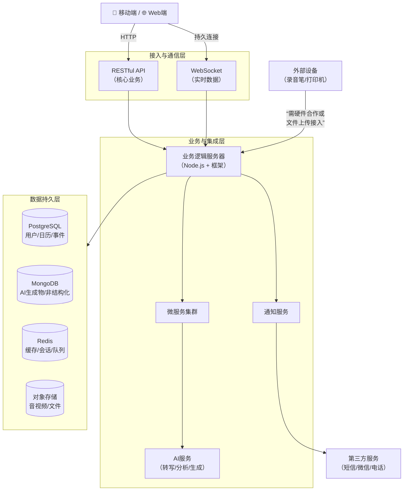

这是一个非常棒且复杂的**多模态生产力工具**需求，它融合了实时媒体处理、AI集成、多端同步、智能通知和硬件接入。我将基于这些特点，为你推荐一套**针对性**的技术组合。

### 🗃️ 数据库选型：混合架构是必然选择
单一数据库无法满足所有需求，以下是推荐组合：

| 数据类型/功能                              | 推荐数据库                                                   | 理由                                                         |
| :----------------------------------------- | :----------------------------------------------------------- | :----------------------------------------------------------- |
| **用户、权限、日历事件、通知记录**         | **PostgreSQL**                                               | **关系型数据**的首选。事务性强，保证数据一致性（如日历提醒）。支持JSONB，可灵活存储AI生成的摘要、标签等。 |
| **实时转写文字流、设备状态日志、性能监控** | **时序数据库 (如 InfluxDB)** 或 **PostgreSQL (TimescaleDB扩展)** | 专门为**时间序列数据**优化，高效处理源源不断的转录文字流和设备状态记录，便于后续分析与提醒触发。 |
| **AI生成的脑图、流程图、文档**             | **MongoDB**                                                  | 存储**非结构化、形态多变**的AI产出物（JSON格式的脑图节点、Markdown摘要等）非常灵活。 |
| **录音/录屏文件、文档附件**                | **对象存储 (如 AWS S3/MinIO)**                               | 专为海量**二进制大文件**设计，成本低、易扩展，并通过链接与主数据库关联。 |
| **实时会话状态、通知队列、缓存**           | **Redis**                                                    | **内存数据库**，性能极高。用于管理录音状态、存放待发送的提醒队列、缓存用户频繁访问的AI生成内容。 |

**一句话总结**：使用 **PostgreSQL + MongoDB + Redis + 对象存储** 的混合方案，各司其职。

### 🌐 API风格：分层与混合使用
没有“银弹”，需要根据场景组合使用：

| 通信场景                                  | 推荐API风格        | 应用示例与理由                                               |
| :---------------------------------------- | :----------------- | :----------------------------------------------------------- |
| **核心业务CRUD** (用户、日历管理)         | **RESTful API**    | 最通用，易于理解、调试和实现。用于Web/移动端大部分常规操作。 |
| **内部微服务通信** (音频流->AI服务)       | **gRPC**           | **高性能、强类型**。适合音频流片段实时传输给AI服务进行转写、或微服务间密集通信。 |
| **实时功能** (字幕推送、多端状态同步)     | **WebSocket**      | **全双工实时通信**。实现“边说边出字幕”、多端实时同步录音/编辑状态。 |
| **复杂数据聚合查询** (查询某时段所有笔记) | **GraphQL** (可选) | 客户端可**一次请求**获取关联的日历、转录文字、AI摘要和脑图，非常高效，但后端实现较复杂。 |

**一句话总结**：对外用 **REST**，对内用 **gRPC**，实时用 **WebSocket**，复杂查询可考虑 **GraphQL**。

### ⚙️ 关键技术组件与挑战提醒
除了数据库和API，这个项目还需要整合以下关键组件，并注意相应挑战：

1.  **实时音频/视频流处理**：需要专门的媒体服务器（如 `WebRTC` 用于实时传输，`FFmpeg` 用于格式处理）。
2.  **AI服务集成**：
    *   **语音转文字 (ASR)**：可接入科大讯飞、阿里云、或开源模型（如 Whisper）。
    *   **内容分析与生成**：需要接入 **大语言模型 (LLM)** API（如 GPT-4, Claude）或自行微调开源模型，来生成摘要、脑图等。
3.  **多端数据同步**：这是核心挑战，需设计强大的**冲突解决机制**（如 `CRDT` 算法），保证在Web端和移动端编辑同一份笔记时的最终一致性。
4.  **通知与消息推送**：
    *   **应用内**：Web端用 **WebSocket**，移动端用各自系统的推送服务（APNs/FCM）。
    *   **外部**：短信/电话需要第三方服务商；微信提醒需申请企业微信或公众号模板消息接口。
5.  **外部设备接入**：这是**最大工程挑战之一**。
    *   **打印机**：可通过操作系统打印服务或云打印API。
    *   **录音笔**：几乎没有开放协议的，通常需要与特定品牌进行**硬件层合作**，或让用户通过App上传文件。

### 💎 最终架构蓝图与行动建议
一个可行的高层架构如下图所示，它综合了上述所有选型：

**给你的行动建议**：
1.  **分阶段启动**：先做核心的**录音转文字+日历提醒（Web+移动）**，使用 **PostgreSQL + REST API** 实现。这是验证市场需求的关键。
2.  **逐步集成AI**：在核心功能稳定后，接入AI服务生成摘要，此时可引入 **MongoDB** 存储结果。
3.  **最后攻坚硬件**：外部设备接入和实时多端同步（WebSocket）技术复杂度最高，放在后期。

### 分阶段启动

| 阶段                            | 推荐技术栈                       | 核心考虑                                                     |
| :------------------------------ | :------------------------------- | :----------------------------------------------------------- |
| **第1阶段：MVP (最小可行产品)** | **采用 Flutter + Supabase**      | **目标**：以最低成本、最快速度验证核心功能（录音转文字、日历提醒、基础AI摘要）。 **做法**：利用Supabase的PostgreSQL存储所有结构化数据，JSON字段存AI生成物；用其Realtime和存储功能。 |
| **第2阶段：功能深化与扩展**     | **在Supabase基础上引入专用服务** | **目标**：补齐短板，应对增长。 **做法**： 1. **接入专业通知服务**（如Twilio、阿里云短信）实现电话、微信等提醒。 2. 为**海量音视频文件**，继续使用Supabase存储或迁移至更经济的对象存储。 |
| **第3阶段：规模扩展与架构演进** | **评估向混合架构迁移**           | **目标**：应对百万级用户和数据。 **做法**：如果AI生成物（脑图等）变得极其复杂，可引入**MongoDB**专库存储；核心事务数据仍留在PostgreSQL。此时Supabase可作为起点，部分服务可逐步替换为自建微服务。 |

